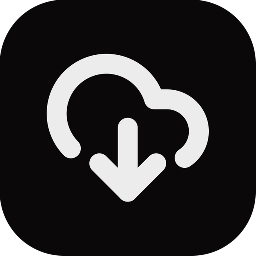

<p align="center">
  
</p>

<h1 align="center">napster</h1>

A self-hosted web app that turns YouTube Music links into a tidy, fully tagged music library.

- **Downloads:** paste a song, album or playlist link and get `.m4a` files with correct tags and square cover art, filed as `Album Artist/Album/01. Title.m4a`.
- **Library:** browse the music folder, re-tag albums already on disk in bulk, and undo any re-tag byte-for-byte.

<p align="center">
  
</p>

## Features

- **Best audio, no re-encoding.** yt-dlp downloads YouTube's best AAC stream as-is.
- **Whole-album matching.** Albums are matched on [MusicBrainz](https://musicbrainz.org) as a whole, by comparing tracklists, so songs never drift onto compilations or deluxe editions. Single songs are matched by title and artist, with "(Official Video)", "(Lyrics)" and similar removed first.
- **Clean artist tags.** One artist per track; everyone else goes into the title as `(ft. A, B)`. Every song on an album shares one album artist (the most frequent one), so albums show up as one album in Navidrome, Jellyfin and Plex.
- **Square covers.** Covers come from Deezer, at 1000 or 500 px, and fall back to the YouTube thumbnail or the existing cover, cropped square.
- **Every file is verified.** It's read back after writing to check its tags and cover.
- **Safe re-tagging.** Originals are hard-linked into a hidden backup folder first (no extra disk space), so any re-tag can be undone.
- **YouTube cookies.** Upload a `cookies.txt`, read them straight from a browser, or sync them from your computer with a script. Only youtube.com cookies are kept.
- **Easy to run.** No database: settings and history are small JSON files. Everything is configured in the app's Settings page.

## Stack

SvelteKit (Svelte 5) · TypeScript · Tailwind CSS v4 · shadcn-svelte · Bun · yt-dlp · ffmpeg · Docker Compose

## Run locally (macOS)

```sh
brew install oven-sh/bun/bun yt-dlp ffmpeg deno
bun install
bun run dev
```

The shadcn-svelte components are committed in `src/lib/components/ui/`. If that folder is missing (for example, in a copy made without it), add them first:

```sh
bunx shadcn-svelte@latest init   # accept the defaults: src/app.css and the $lib aliases
bunx shadcn-svelte@latest add button input badge progress label select radio-group switch textarea checkbox sheet tabs collapsible
```

Open http://localhost:5173 and go to **Settings**:

1. Set the **Music folder** (a full path; in dev it defaults to `~/Downloads`).
2. Add your email as the **MusicBrainz contact** (required by their API).
3. Under **YouTube cookies**, pick your browser and click **Import now and save**.

On macOS, Chrome-based browsers ask for Keychain access on import, and Safari needs Full Disk Access for your terminal.

## Host it (Docker)

The image is built by GitHub Actions and pushed to `ghcr.io/<owner>/<repo>:latest` on every push to `main`.

**1. Configure it.** On the server, next to `compose.yaml`:

```sh
cp .env.example .env
```

```sh
ORIGIN=https://napster.example.com   # the exact URL you open it at
MUSIC_DIR=/path/to/music             # must exist and be writable
PORT=3000
NAPSTER_IMAGE=ghcr.io/<owner>/napster:latest   # omit to build locally
```

**2. Start it:**

```sh
docker compose pull && docker compose up -d     # or: docker compose up -d --build
docker compose logs -f
```

**3. Finish setup** in **Settings**: keep the music folder as `/music`, pick the **file owner** (the user that owns your music), and add the MusicBrainz contact.

**4. Send cookies.** There's no browser on the server, so send cookies from your computer to the server's LAN address:

```sh
scripts/sync-cookies.sh firefox http://<server-lan-ip>:3000
```

> [!IMPORTANT]
> napster has no login. Keep it on your local network, or put an authentication layer in front of it (for example Cloudflare Access) before exposing it to the internet.

### Updating

```sh
docker compose pull && docker compose up -d
```

YouTube regularly breaks old yt-dlp versions. To get the latest one into the image, bump `ARG YTDLP_REFRESH` in the `Dockerfile` and push. For a quick fix until the container is next recreated:

```sh
docker compose exec napster /opt/yt-dlp/bin/pip install -U "yt-dlp[default]"
```

## Where things live

| What | Where |
|---|---|
| Settings, history, backup list, cookies, cover thumbnails | `data/` |
| Downloaded and re-tagged music | the music folder |
| Backups of re-tagged originals | `<music folder>/.napster-backups/` (skipped by Navidrome via `.ndignore`) |

## Development

```sh
bunx shadcn-svelte@latest add <component>   # UI components live in src/lib/components/ui
bun run check                                # svelte-check + TypeScript
bun run build
```

CI (`.github/workflows/ci.yml`) runs the checks and builds the Docker image on every push and pull request.
